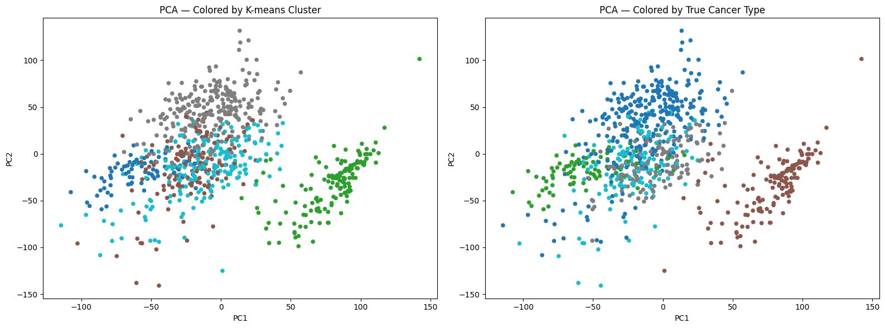
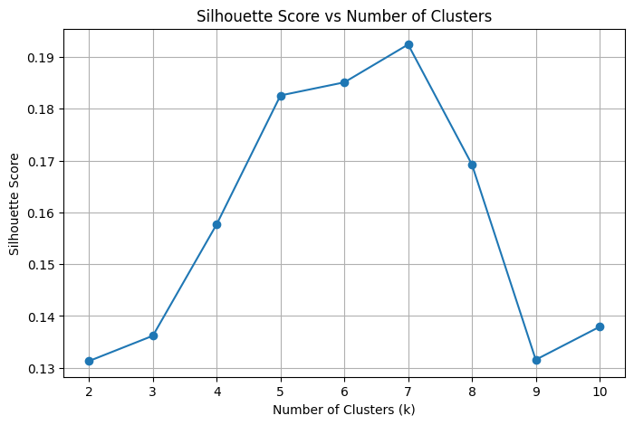

# Cancer Transcriptomics Analysis

A self-directed computational biology project exploring whether cancer types can be distinguished using gene-expression profiles.

The project begins with an exploratory analysis of a TCGA-derived benchmark dataset using dimensionality reduction and unsupervised learning. The next stage will extend the analysis to gene-identifiable TCGA transcriptomic data to investigate the genes and biological pathways contributing to the observed structure.

## Research Question

To what extent can cancer types be distinguished from their gene-expression profiles, and what can the resulting structure tell us about similarities between tumour types?

## Dataset

The pilot analysis uses the UCI Gene Expression Cancer RNA-Seq dataset, derived from The Cancer Genome Atlas (TCGA).

The dataset contains:

- 801 tumour samples
- 20,531 gene-expression features
- 5 cancer types: BRCA, KIRC, COAD, LUAD and PRAD

The dataset uses non-descriptive gene identifiers, which allows exploration of expression patterns but limits gene-level biological interpretation. This is one reason the next stage will use gene-identifiable TCGA data.

## Analysis Workflow

The analysis started with basic checks of the dataset, including its dimensions, class distribution and missing values. The expression features were then standardised before applying PCA to reduce the dimensionality of the data.

I explored the cluster structure using the elbow method, silhouette scores and hierarchical clustering. K-means was then used for the final clustering, with the resulting groups compared against the known cancer labels using the Adjusted Rand Index (ARI).

PCA and t-SNE were also used to visualise how the cancer types were distributed in lower-dimensional space.

## Key Results

The final K-means model used five clusters to compare the clustering structure with the five known cancer types. The clustering achieved an Adjusted Rand Index (ARI) of 0.794.

COAD, KIRC and PRAD formed relatively distinct clusters, while BRCA and LUAD showed more overlap. This pattern was also visible in the PCA and t-SNE visualisations.

The methods used to estimate the number of clusters did not completely agree. The silhouette score was highest at seven clusters, while the elbow method and hierarchical clustering suggested different structures. I therefore treated five clusters as a useful comparison with the known labels rather than claiming it was the objectively optimal number of clusters.

## Visualisations

### Cluster structure

The PCA comparison below shows the structure identified by K-means alongside the known cancer types.

### Choosing the number of clusters

The silhouette analysis produced its highest score at seven clusters. This was considered alongside the elbow method and hierarchical clustering before using five clusters for comparison with the five known cancer types.

## Limitations

The dataset is a pre-processed benchmark dataset and the gene identifiers are non-descriptive, so the current analysis cannot identify which genes are driving the separation between cancer types.

The clustering results also depend on choices such as scaling, dimensionality reduction, the clustering algorithm and the number of clusters. The BRCA/LUAD overlap should therefore be interpreted as overlap in the expression structure observed in this analysis, rather than evidence of a specific biological relationship.

## Next Steps

The next stage is to move from the benchmark dataset to gene-identifiable TCGA transcriptomic data. This will allow the analysis to go beyond clustering and investigate which genes contribute to the differences between cancer types.

Planned work includes differential expression analysis and pathway-level interpretation, with particular attention to the BRCA/LUAD overlap seen in the pilot analysis.

## Repository Structure

- `notebooks/01_pilot_clustering.ipynb` - pilot analysis of the benchmark gene-expression dataset
- `notebooks/README.md` - overview of the analysis notebooks
- `figures/` - selected visualisations from the pilot analysis

## Tools

Python, Pandas, NumPy, scikit-learn, Matplotlib, Jupyter Notebook
